# Graduation Rate Predictions
Fred Berendse

## Motivation
Institutions of higher education stand as beacons of progressive thought and social change. Yet, our society still struggles to realize equity in the courtroom, in the workplace, and in the classroom. Education is touted as the great equalizer that opens doors for the oppressed. If this is true, then equity in education must be a top priority for creating positive social change. It is necessary to examine how our institutions of education, from pre-K to post-secondary, are facilitating (or preventing) the path toward this ideal. 

The motivating goal of this capstone project is to determine whether one can accurately predict an institution’s graduation rate for minority/low SES students based on institutional features. Also, which of these features is most influential on graduation rate?

## The IPEDS Dataset
The National Center for Education Statistics, part of the US Department of Education, has a publicly available central repository for postsecondary education data: the [Integrated Postsecondary Education Data System (IPEDS)](https://nces.ed.gov/ipeds/). Data contained in the data system are aggregate data reported by over 7000 US postsecondary institutions reported annually in three reporting periods. 

At the time of this capstone project, the data in Table 1 were publicly available from the IPEDS database. 

*Tables in the IPEDS dataset*

The data from these tables can be downloaded in CSV for all collection years listed. Beginning with the 2006-07 collection year, annual collections were also compiled into an MS Access database. Unfortunately, data are not available in other database formats (e.g. Oracle, Postgres, and MongoDB). For this reason, I created the [IPEDS python library](https://github.com/Fred-B-Berendse/ipeds_library) to read in and merge tables from this database. 

One challenge presented by these tables is that several of them are many-to-one tables _i.e._ multiple rows refer to a single institution. Merging these into a single one-to-one table for modeling results in a very wide table. Therefore, feature selection will become a very important aspect of this project.

*An example of a many-to-one table in the IPEDS dataset. This is a snippet of the first few columns of the GR2017 table.*

The following tables from the 2016-2017 reporting year were used in this analysis. A description of the columns extracted from each table can be found [here](columns.md). 

| Table | Rows | Full Rows | Description |
|--------|------------|-----------|-------------|
| HD2017 | 7153 | 7153 | Institutional name, location, and descriptive categories | 
| ADM2017 | 2075 | 920 | Application, admission and enrollment data including SAT/ACT percentiles |
| GR2017 | 54714 | 49981 | Number of students who completed a bachelor's degree within 100% (2013 cohort), 125% (2012 cohort), and 150% (2011 cohort) of normal time disaggregated by gender and race/ethnicity |
| GR2017_PELL_SSL | 9116 | 5557 | Number of students who completed a bachelor's degree within 150% (2011 cohort) of normal time, disaggregated by Pell Grant recipients, Subsidized Stafford Loan recipients, and non-recipients |
| SFA2017 | 6394 | 0 | Number of students paying in-state/out-of-state tuition and receive grant/scholarship aid, disaggregated by aid type and income level |

*The column "Full Rows" indicates the number of rows that do not contain any NaN values.*

## Data Cleaning

The raw data were cleaned using methods from the [IPEDS pipeline library](https://github.com/Fred-B-Berendse/ipeds_library). This library allows one to build a collection of tables with its `IpedsCollection` class. The collection contains methods to keep only a subset of columns, purge unwanted imputation values, map numerical categories to strings, filter rows by category values, flatten many-to-one tables, and finally merge those tables to a single table.

*The IPEDS cleaning pipeline*

The first attempt to clean the dataset raised three key issues addressed below.

### The Admissions Table
 The admissions table (ADM2017) only has 939 full rows after the keep columns/purge imputations steps. A snapshot of ten random rows from the raw table (shown below) reveals two reasons why: 1) some institutions did not report part-time enrollment totals, and 2) many institutions did not report both SAT and ACT quartiles.

*Ten random rows from the ADM2017 table. Many institutions did not report SAT/ACT quartiles. Some did not report part-time enrollment totals.*

Blank part-time enrollment totals can easily be fixed by imputing values by subtracting full-time enrollment from the total enrollment count.

Below are the number of institutions that reported SAT/ACT quartile data:

| Reported | Count |
|----------|-------:|
| Neither SAT nor ACT | 753 |
| SAT only | 109 |
| ACT only | 83 |
| Both SAT and ACT | 1130 |
|||
| Total | 2075 |
||| 

 The second problem, however, is trickier to solve since many post-secondary institutions don't require SAT/ACT tests. To resolve this, each benchmark was normalized to a mean of 0 and standard deviation of 1. The mean of the two standardized test benchmark was calculated as a new feature in the dataset.

### The Graduation Table
The second key issue is that the graduation rate table (GR2017) has only 753 full rows after it is flattened to a one-to-one table. 

 Each student within the bachelor's degree cohort is assigned a cohort status (*e.g* completed in 4 years, completed in 5 years, completed in 6 years, transfered out, not completed - still enrolled, or not completed - no longer enrolled). A small institution that did not have any students transfer out would have no row for that cohort status in the table. When the table is flattened to a one-to-one table, that status is entered as NaN for that institution. To fix this issue, values of 0 are imputed for NaN values after the table is flattened. 

If an instiution has no members of a particular race/ethnicity within a cohort, calculating a percentage will result in a division by zero. To fix this issue, Laplace smoothing is applied when calculating the percentage in such a way that the graduation percentage for all races will replace a potential division by zero.

### The Graduation Pell/SSL Table
The Graduation Pell/Subsidized Stafford Loan (SSL) table contains categories (Pell Grant recipient, SSL without Pell recipient, non-recipient) with a zero count. This would return NaN values as a graduation rate for that category. To fix this issue, an overall graduation rate was calculated from sums over all categories. Laplace smoothing with a pseudocount of 0.01 times the sum over all three categories was used. 

### The Student Financial Aid Table
Finally, the student financial aid column (SFA2017) has __no__ full rows in any of the steps of the pipeline process. 

This was addressed by doing three things:

* Dropping columns that contain counts of students paying in-district, in-state, and out-of-state tuition fees.
* Dropping rows that only contain information about percentages of undergraduates awarded financial aid
* Imputing a value of 0 for rows containing no value for the number of students living on campus. This was done after verifying that the counts of students living off campus sum to equal the number of students.

### Final pipeline
Once these three key issues were resolved, the pipeline produces the following number of rows (full rows) for each stable during key steps in the process.

| Table | Raw | Keep Columns / Purge Imputations | Filtering Categories | Flattening Tables | Imputing Values |
|-------|-----|----------|-----------|---------------|------------|
| HD2017            | 7153 (7153)   | 7153 (7153)   | 7153 (7153)   | 7153 (7153) | 7153 (7153) |
| ADM2017           | 2075 (920)    | 2075 (1130)    | 2075 (1130)    | 2075 (1130)  | 2075 (1322) |
| GR2017            | 54714 (49981) | 54714 (49981) | 4203 (4203) | 2139 (2064) | 2139 (2123) |
| GR2017_PELL_SSL   | 9116 (5557)   | 9116 (5557)   | 2139 (2139)   | 2139 (2139) | 2139 (2139) |
| SFA2017           | 6394 (0)      | 6394 (1184)   | 6394 (1184)   | 6394 (1184) | 4029 (4029) |
|||||||
*Finalized pipeline. The number in parentheses is the number of full (non-NaN) rows.*

The final step in the pipeline is to merge all of the tables by an institution's unitid then drop rows containing any NaN values. The merged table contains 682 institutions available for modeling. 

## Exploratory Data Analysis

### Graduation Rates 

There are 307244 students in the 2011 cohort across all institutions in the dataset. Of those, 209811 students received a bachelor's degree within 150% of normal time (*i.e.* 6 years). The bar graph below shows the racial breakdown of these students. A bar graph of racial distribution from the U.S. Census (2018 estimate) is shown for comparison.

*Number of bachelor's degree completions across all institutions in the dataset. U.S. Census (2018 estimate): https://www.census.gov/quickfacts/fact/table/US/IPE120218*

Because there is such a small number of American Indian/Native Alaskan and Native Hawaiian/Pacific Islander students in the dataset, it was decided to exclude these races from further analysis.

Distributions of graduation rates among all institutions in the dataset show that students receiving need-based financial aid tend to have lower graduation rates than their white peers.

A similar disparity exists between students receiving federal need-based aid compared to their more affluent peers.

Correlation plots of graduation rates between different races reveals a surprising amount of collinearity: institutions that have high white graduation rates also tend to have higher minority graduation rates.

Likewise, institutions that graduate a high percentage of non-recipients also graduate a higher percentage of financial aid recipients.

### Principal Component Analysis
A principal component analysis was performed on the table of institutions to determine if there is some combination of features (called a principal component) which can separate high graduation rates from low graduation rates. The first principal component accounts for 16.0% of the total variance of the data in feature space. Subsequent axes account for 6.3% or less per axis.

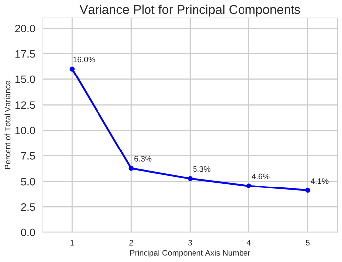
*Principal Component Analysis (PCA) variance plot*

Below is a series of scatterplot maps of each institution along the two most important principal components. Each institution is labeled with its graduation rate. One can see from these maps that high graduation rates tend to be separated from low rates on the map. These results demonstrate that supervised learning models are likely able to predict graduation rates to some degree.

|  |  |
|:-------------------------:|:-------------------------:|
| 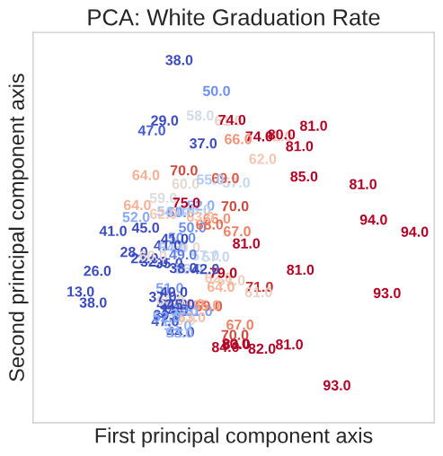 |   |
|  |   |
  |
 ||| 
 *Principal Component Analysis (PCA) maps of graduation rates by race*

|  |  |
|:-------------------------:|:-------------------------:|
|  |   |
|  ||
|||
*Principal Component Analysis (PCA) maps of graduation rates by Pell/SSL status*

When graduation rates of different races or grant/loan status are used as labels, one generally sees the same trend. It may be possible that the Laplace smoothing is causing this. To test this, graduation rates without smoothing were also mapped onto component space. For most races and grant/loan status, this did not change the general trend. However, two groups, 2+ races and Asians, showed a much more homogeneous mixutre of high and low graduation rates when smoothing was removed. 

| With Laplace Smoothing | Without Laplace Smoothing |
|:-------------------------:|:-------------------------:|
|  |   |
|  |  |
|  |  |
|||
*Principal Component Analysis (PCA) maps with and without Laplace smoothing*

It makes sense that these two minority categories would be affected by smoothing since they have smaller counts than other race categories. 

The principal component analysis class in `sklearn` utilizes singular value decomposition (SVD) to determine the principal component axes. SVD decomposes a matrix of institutions and their features into a multiplication of three separate matrices. The last of these matrices contains values that indicate how each feature loads onto each principal component. By looking at the values in the first row of this vector, we can get a general idea of which features are most important along the first principal component. Below are the ten features that load most onto the first principal component axis:

* average math 25th percentile
* average math 75th percentile
* average english 25th percentile
* average english 75th percentile
* percent of undergraduates awarded a Pell Grant
* average net price for students awarded grant or scholarship aid
* percent of applicants admitted
* institution size: 10,000 to 20,000 
* percent of undergraduates awarded finiancial aid (any source)
* percent of students living on campus

## Modeling

### Ordinary Linear Regression

The first two models fitted are linear regression models. One of the strengths of a regression model is that its coefficients are interpretable if the following conditions are met:

* __Linearity__: violated when nonlinear trends exist in residuals
* __Independence__: violated if a point depends on the value of another point in the data set
* __Homoscedasticity__: violated when the variance of residuals isn't constant 
* __Normality__: violated when the residuals are not normally distributed
* __Multicollinearity__: violated when one feature is highly correlated with others

Two of these assumptions can be checked before running the model: independence of data points and multicollinearity. We will assume that independence holds. It seems to be reasonable given that no student attends more than one institution and each institution can set its own policy decisions even if it is part of a multi-campus system. 

Multicollinearity can be checked by calculating a variance inflation factor for each of the features in the model. The feature with the largest variance inflation factor was eliminated and the process repeated until no remaining features had a variance feature factor above five. The surviving features after this recursive elimination are in the table below.

| Feature | Description | Variance Inflation Factor |
|---------|-------------|---------------------------|
| control_privnp | control: private, not-for-profit | 1.19 |
| hloffer_psotmc | highest degree: post-masters certificate | 1.08 |
| hloffer_postbc | higest degree: post-bachelors certificate | 1.05 |
| hbcu_yes | is a HBCU | 1.35 |
| locale_ctylrg | locale: city, large | 1.68 |
| locale_ctysml | locale: city, small | 1.41 |
| locale_ctymid | locale: city, midsize | 1.41 |
| locale_twndst | locale: town, distant | 1.69 |
| locale_rurfrg | locale: rural, fringe | 1.23 |
| locale_twnrem | locale: town, remote | 1.39 |
| locale_submid | locale: suburb, midsize | 1.14 |
| locale_subsml | locale: suburb: small | 1.14 |
| locale_twnfrg | locale: town, fringe | 1.17 |
| locale_rurdst | locale: rural, distant | 1.13 |
| locale_rurrem | locale: rural, remote | 1.09 |
| instsize_1to5k | institution size: 1,000 to 4,999 | 2.25 |
| instsize_5to10k | institution size: 5,000 to 9,999 | 1.92 |
| instsize_10to20k | institution size: 10,000 to 19,999 | 1.61 |
| instsize_gt20k | institution size: 20,000+ | 1.38 |
| longitud | longitude of institution | 1.13 |
| latitude | latitutde of institution | 1.19 |
| admssn_pct | percent of applicants admitted | 1.73 | 
| enrlt_pct | percent of admissions enrolled | 1.71 |
| enrltft_pct | percent of enrolled students attending full time | 1.20 |
| en25 | average of normalized ACT English/SAT Verbal 25th percentile | 3.50 |
| uagrntp | percent of students awarded financial aid (any source) | 1.64 |
| upgrntp | percent of students awarded Pell Grants | 3.08 |
| npgrn2 | Average net price - students awarded grant or scholarship aid, 2016-17| 2.15 |
| grntwf2_pct | percent of students living with family off campus 2016-17 | 1.61 |
| grntof2_pct | percent of students living off campus (not with family) 2016-17  | 1.40 |

Several of the percentage features are very different than a normal distribution. Percentages bunched near zero (enrlt_pct and grntwf2_pct), these were transformed by the function `log10(percent + 1)`. Percentages bunched near 100 (enrlft_pct, uagrntp, and grntof2_pct) were transformed by the function `log10(101-percent)`. 

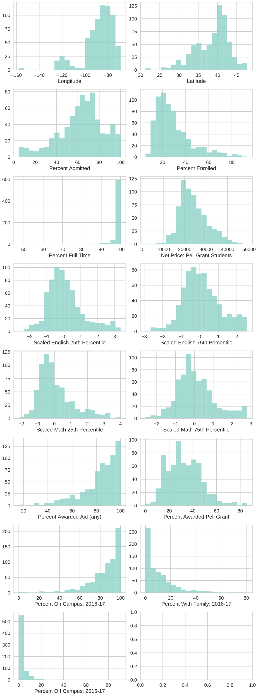
*Histograms of features used in linear regression modeling.*

A linear regression was performed on each race and Pell Grant/SSL status. All features and targets were standardized to a mean of zero and standard deviation of 1 before fitting. The data were split into a 25% test- 75% train. 

Below are the residual sum of squares and the root mean squared error for each of the regressions.

| Target | Train R2 | Test R2 | Test RMSE |
|--------|------|----------|---------|
| 2 or More Races | 0.59 | 0.44 | 15.5 |
| Asian | 0.52 | 0.46 | 16.2 |
| Black | 0.64 | 0.54 | 15.9 |
| Hispanic | 0.56 | 0.30 | 18.4 |
| White | 0.73 | 0.72 | 9.4 |
| Pell Grant | 0.71 | 0.66 | 11.6 |
| Stafford Loan (SSL) | 0.65 | 0.41 | 14.8 |
| Non-Recipient | 0.56 | 0.47 | 13.9 |
|||||

The residuals of each regression all have very normal-like distributions, indicating that the normality condition of a linear regression has at least been loosely met.

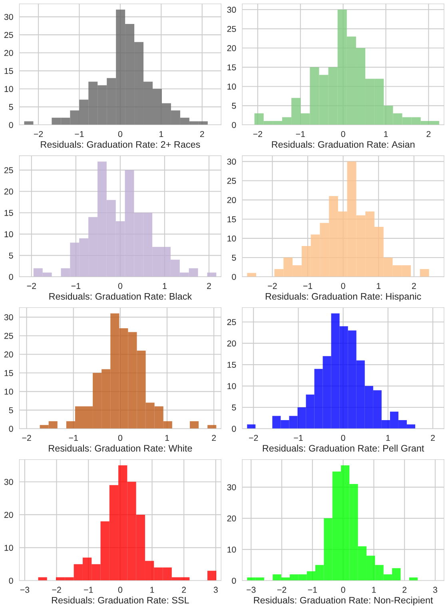

Scale-location (or spread-location) plots are [an accepted method to test for homoscedacity](https://boostedml.com/2019/03/linear-regression-plots-scale-location-plot.html). These graphs show the square root of the absolute value of standardized residuals vs the predicted value. If a scale-location graph shows a horizontal trend with equal spread along the entire graph, then both the homoscedacity condition of linear regression is met.

The scale-location graphs shown loosely meet these criteria, although there is some extra spread for low fitted values as well as a hint that the residual decreases for higher values.

The coefficients of the regression using normalized features and targets reveals that the most influential features are the same as those identified by PCA analysis: the SAT Verbal/ACT English 25th percentile benchmark and the percentage of students who received a Pell Grant. A third influential feature came out of this analysis: latitude. Apparently, universities located farther north tend to have higher graduation rates for all races and financial aid statuses. 

If the coefficients of this model are reliable, then the model also indicates that living off campus with family members has a larger negative effect on black students than students in other categories. The model also shows that while the percentage of students who received a Pell Grant is negatively correlated with graduation rates for all categories, this correlation is stronger for white students than those of other races.  

*Linear regression coefficients for normalized targets and features.*

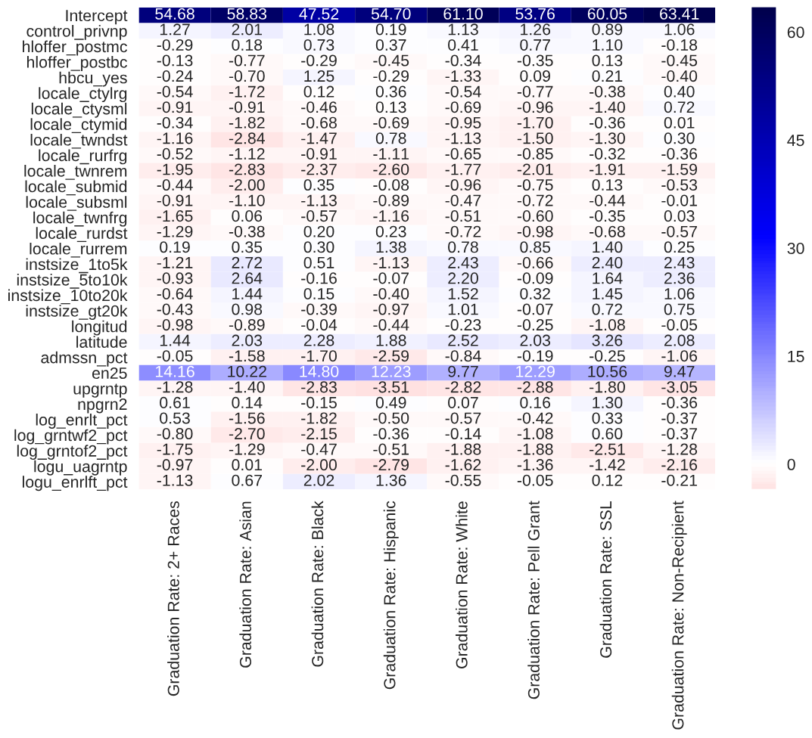
*Linear regression coefficients scaled to features.*

### Lasso Linear Regression

In an attempt to limit the number of features, normalized targets and features were fitted with sklearn's `MultiTaskLassoCV` model, which utilizes cross validation to optimize the shrinkage hyperparameter $\alpha$. For this model, five-fold validation was used with a maximum number of iterations of 100. Because the targets were pre-normalized, the option to fit the intercept was turned off. 

When the model was run on the training set, only 13 iterations were necessary to find that the best value of $\alpha$ was around 0.08. Below are the best-fit values of $\alpha$, as well as R2 and RMSE for each target. Residuals and coefficients for each model are very similar to the ordinary regression model.

| Target | Train R2 | Test R2 | Test RMSE |
|--------|------|----------|---------|-----|
| 2 or More Races | 0.57 | 0.49 | 14.9 |
| Asian | 0.49 | 0.50 | 15.5 |
| Black | 0.62 | 0.54 | 16.0 |
| Hispanic | 0.53 | 0.39 | 17.1 |
| White | 0.71 | 0.72 | 9.5 |
| Pell Grant | 0.69 | 0.68 | 11.3 |
| Stafford Loan (SSL) | 0.62 | 0.41 | 14.7 |
| Non-Recipient | 0.54 | 0.46 | 14.1 |
|||||

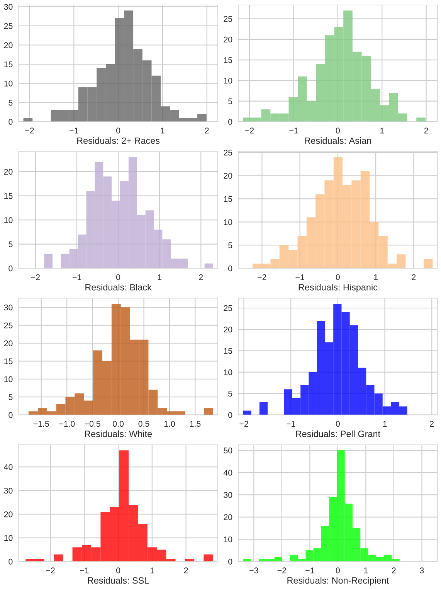*Residuals of Lasso regularized regression to normalized targets and features.*

*Spread-location graph of residuals: Lasso regularized regression to normalized targets and features.*

*Coefficients of Lasso regularized regression to normalized targets and features.*

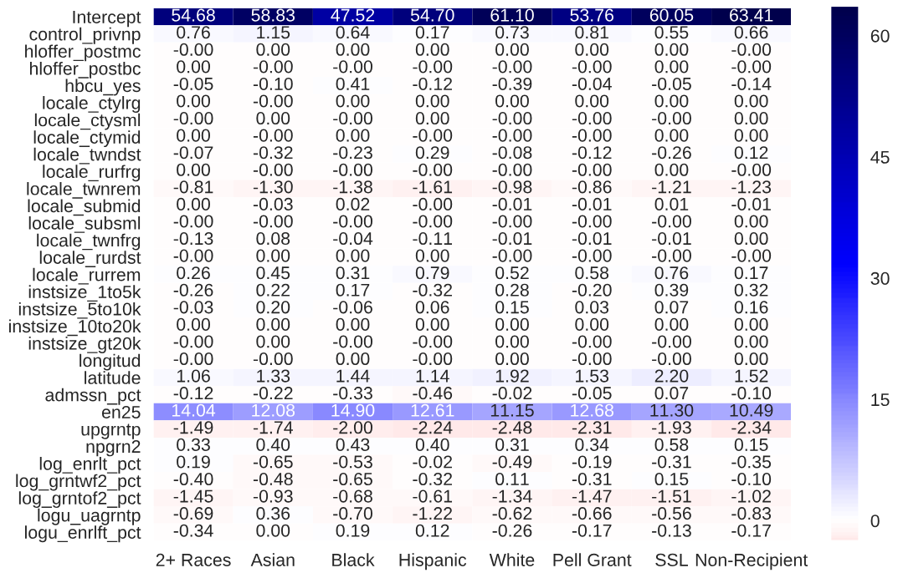*Coefficients of Lasso regularized regression when scaled to feature dimensions*

### Random Forest Regression

A random forest regression was the next model utilized to predict graduation rates. A baseline model was first fitted to get a general idea of the performance of random forest model compared to the regression models. Once a baseline performance was established, sklearn's `GridSearchCV` module was employed to do cross validation to search for the best combination of hyperparameters. The table below shows the range of values made available for the search. 

| Hyperparameter | Baseline Model | Search Range | Best Model |
|-----------|----------|------------|--------------|
| number of trees | 100 | 100 - 200 (steps of 10) | 160 |
| criterion for split | mean-squared error (MSE) | MSE, mean-absolute error (MAE) | MSE |
| min samples for split | 2 | 2, 4, 6, 8, 10 | 2 |
| max features per split | n_features | n_features, sqrt(n_features) | sqrt(n_features) |
||||

Both the baseline and best random forest models yield values of R2 comparable to regression models. The random search for hyperparameters using cross validation did not significantly improve the model's performance. Interestingly, however, the root mean squared errors are lower for random forest than for the linear regression models. 

| Target | R2 | RMSE |
|--------|----------------|------------|
| Two or More Races | 0.513 (0.464) | 14.55 (15.26) |
| Asian | 0.506 (0.457) | 15.39 (16.13) |
| Black | 0.619 (0.582) | 14.49 (15.18) |
| Hispanic | 0.402 (0.393) | 16.96 (17.09) |
| White | 0.724 (0.693) | 9.35 (9.85) |
| Pell Grant | 0.694 (0.681) | 10.95 (11.17) |
| SSL | 0.433 (0.332) | 14.46 (15.69) |
| Non-Recipient | 0.428 (0.446) | 14.45 (14.22) |
||||
*Performance metrics of the best random forest model selected by CV. Metrics of the baseline model are in parentheses.*

The best random forest model shows that the two most important features are the average normalized SAT/ACT English 25th percentile benchmark and the percentage of students who received a Pell Grant - consistent with the PCA analysis and regression models. The third most important feature identified by this model is the percent of applicants admitted to the institution, not the latitude of the institution as was identified by the regression models. 
These rankings were consistent across all target demographics.

|  |  |
|:-------------------------:|:-------------------------:|
|  |   |
|  |  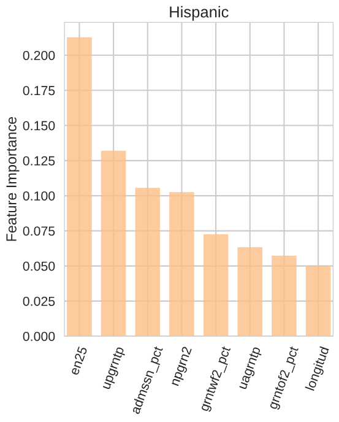 |
|  |  |
|||
*Feature importance plots for all racial/ethnic demographics.*

|  |  |
|:-------------------------:|:-------------------------:|
|  |   |
| 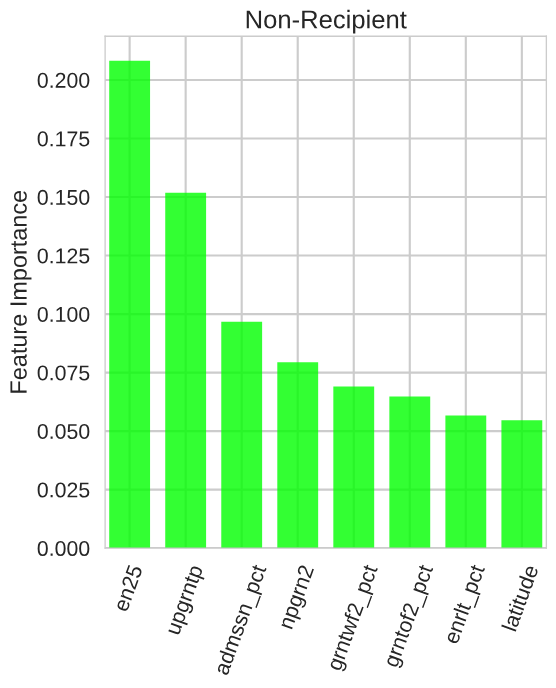 |  |
|||
*Feature importance plots for Pell Grant, SSL, and non-recipient demographics.*

Feature importances do not determine the direction of influence a given feature has upon graduation rates. The influence of each of the top four features is shown. All demographics are impacted very similarly by English 25th percentile benchmark and percentage of students receiving a Pell Grant. There is some variation in the impact of admission percentage between demographics, but this has less than a 5% impact on graduation rate. 

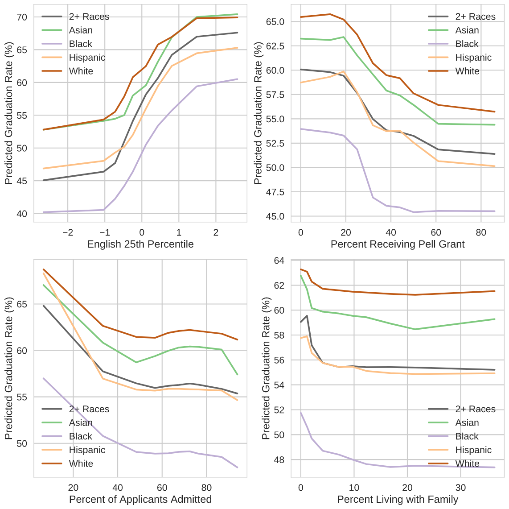
*Partial dependence plots of the top four features for all racial/ethnic groups.*

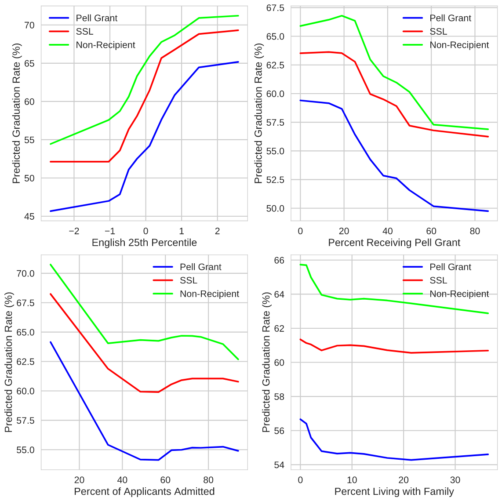
*Partial dependence plots of the top four features for Pell Grant, SSL, and non-recipient groups.*

### Markov Chain Monte Carlo (MCMC) Regression
Describe the MCMC model and its hyperparameters

Coefficients and their interpretation

Posterior graduation rates across all institutions

An example prediction for a given institution showing systemic over- or under-prediction.

### Model Comparison
The performance of the four models can be directly compared by calculating the R2 statistic, *i.e.* the proportion of variance explained by the model, and the root-mean-squared error of the model. 

| Target | OLS | OLS w/Lasso | Random Forest | MCMC |
|--------|-----|--------|-------------|----------|
| 2+ Races | | | | |
| Asian | | | | |
| Black | | | | |
| Hispanic | | | | |
| White | | | | |
| Pell Grant | | | | |
| SSL | | | | |
| Non-recipient | | | | |
||||||
*R2 statistic for the four models across all racial and financial aid groups.*

| Target | OLS | OLS w/Lasso | Random Forest | MCMC |
|--------|-----|--------|-------------|----------|
| 2+ Races | | 15.5% | 14.9% | 15.1% |
| Asian | | 16.2% | 15.5% | 15.7% |
| Black | | 15.9% | 16.0% | 16.4% |
| Hispanic | | 18.4% | 17.1% | 17.4% |
| White | | 9.4% | 9.5% | 9.7% |
| Pell Grant | | 11.6% | 11.3% | 11.4% |
| SSL | | 14.8% | 14.7% | 14.9% |
| Non-recipient | | 13.9% | 14.1% | 14.2% |
||||||
*Root-mean-squared error for the four models across all racial and financial aid groups.*

All four of the models show relatively comparable performance for each racial/financial aid group. The random forest model holds a slight edge in performance across all groups.

## Conclusions and Further Work
Institutional features of 682 institutions in the IPEDS database were modeled with ordinary least-squares linear regression, a Lasso regularized linear regression model, a random forest model, and a Markov chain Monte Carlo model. All four models have very similar values of R2 and root-mean-squared error (RMSE) for a given racial or financial aid group. Across the different groups, values of R2 varied from 0.4 (whites) to 0.6 (Hispanics). The RMSE values ranged from 9.4% (whites) to 18.4% (Hispanics).

All four models agree that the most influential predictors of graduation rates are SAT/ACT benchmark scores. (Only the English 25th percentile was used because these benchmark scores are highly correlated with each other.) Three of the models (linear regression, linear regression with Lasso regularization, and random forest) also list the percentage of students receiving a Pell Grant as an important predictor as well. All three models also show that the graduation rate of one race/ethnicity at a given institution is highly correlated with graduation rates of other races/ethnicities. A similar high correlation exists between Pell Grant/Subsidized Student Loan status groups. 

Many institutions in the test dataset systematically over- or under-predict graduation rates across all racial and financial aid groups across all models. This suggests that metrics of student services may need to be added to the models. However, no such metrics exist in the IPEDS dataset. 

A possible missing feature that can be extracted from the IPEDS dataset is the percentage of bachelors degrees awarded in various fields. It may be possible that certain types of degrees have higher graduation rates. An instiution that graduates a significantly different percentage of its students in these fields may explain the observed systematic over-/under-prediction for that institution. 
